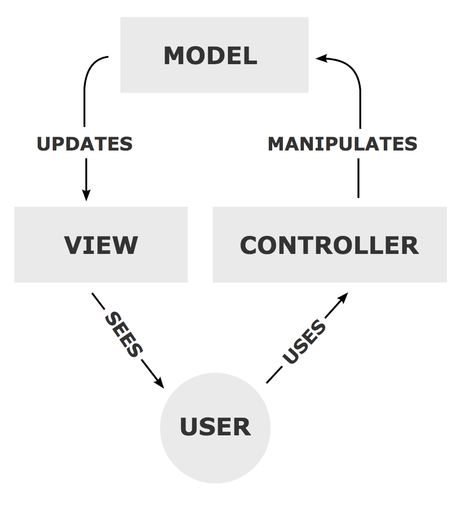

# Building a REST API with GoLang, Gin and Gorm

## Links that helped during the study
[How to architate good go backend rest api services](https://medium.com/@janishar.ali/how-to-architecture-good-go-backend-rest-api-services-14cc4730c05b)

[Creating Go REST API](https://tamerlan.dev/creating-go-rest-api/)

## What is Gin

> *Gin is a HTTP web framework written in Go (Golang). It features a Martini-like API, but with performance up to 40 times faster than Martini.*

## What is Gorm

> *The fantastic ORM library for Golang aims to be developer friendly.*

## Folder structure


*The reason why we don't see a view here is that we are creating REST APIs, which do not have any visual representation.*

## Creating Models
### Installing GORM
Install:

```
go get -u gorm.io/gorm
go get -u gorm.io/driver/mysql
```

I'll use MySql.

To start, I'll create an API to create users. But the idea is changing during time.

## Creating Model
We created a model in ``userModel.go``. 

## Mux
Package `gorilla/mux` implements a request router and dispatcher for matching incoming requests to their respective handler.

## Entendendo um pouco sobre o http.Request
``http.Request`` é uma estrutura da biblioteca padrão ``net/http``, que contém todos os dados relacionados a uma requisição HTTP. Ela armazena informações como o método HTTP (GET, POST, etc), os cabeçalhos da requisição, o corpo da requisição, a URL requisitada, e assim por diante.

## Ponteiros em GO
Em GO, os ponteiros permitem que você referencie diretamente a memória de uma variável ou estrutura. Isso significa que você pode modificar o valor original ou acessar grandes estruturas sem fazer cópias, o que melhora o desempenho. (Basicamente o que acontece em C, que inclusive me facilita mt no aprendizado desta linguagem por ja ter sido apresentado a esses conceitos na faculdade)

`&` é o operador que retorna o endereço de memória da variável.

## Changing the architecture

Bom, para mudar a arquitetura eu utilizei o link que explicava sobre como separar em módulos bem definios para a construção de uma REST API. Tive que mudar algumas configurações que antes estavam no arquivo main ou sem configuração dentro de models/controllers.